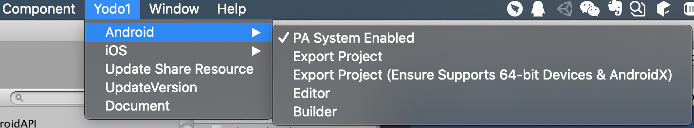
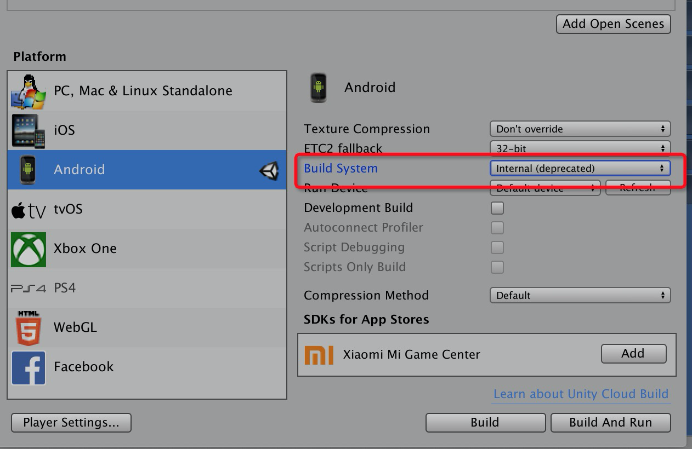
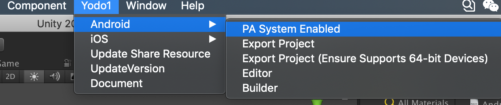
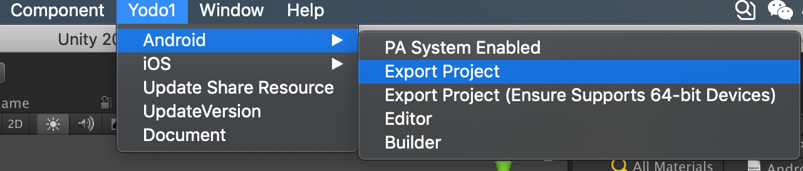
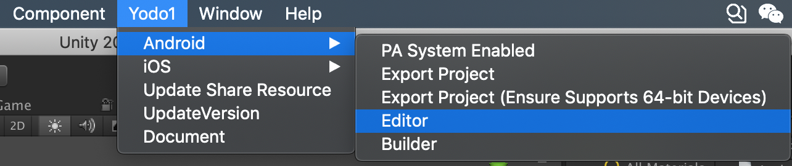
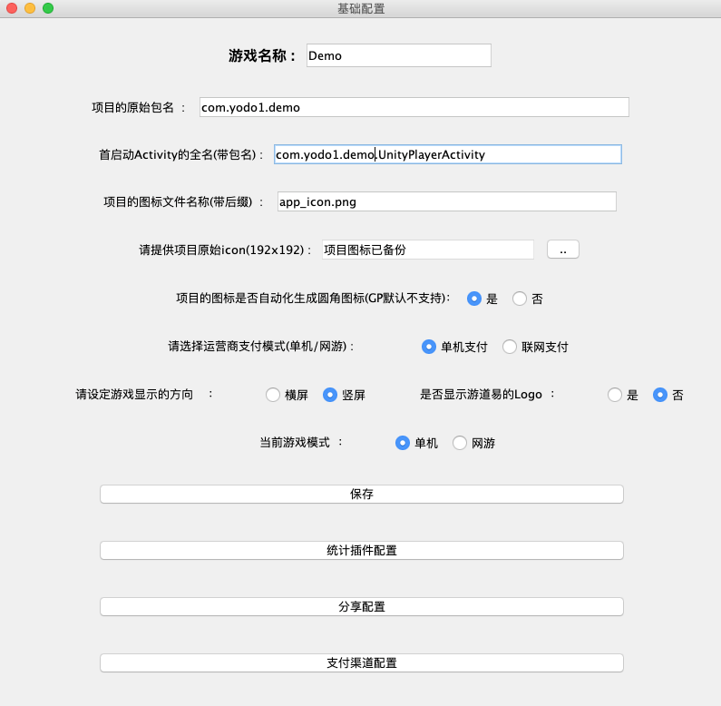
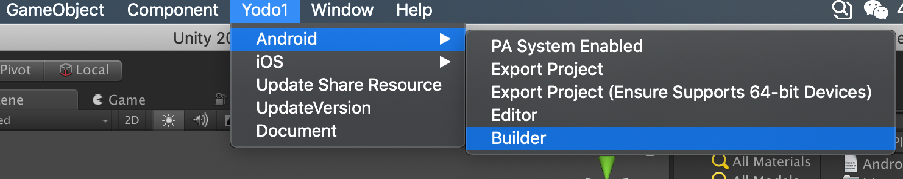

# Android Integrating

About two integration methods:

[**PA integration**](#pa-part) 

A master APK file with only functional interfaces will be generated, which needs to be uploaded to the PA system backend to automate the integration of each channel SDK.

[**Manual integration**](#mal-part)

Using Editor.jar to manually configure the parameters of each channel, and then use Builder.jar to generate the APK file for each channel

For each integration method, we will introduce the relevant configuration methods


## <a name="pa-part">PA integration</a> 

- First you should trun on the PA option in Unity menu `Yodo1/Android/PA system Enabled`



- Modify the content of `Plugins/Android/AndroidManifest.xml`

    - Fix the `application` value

    ```xml

    android:name="com.yodo1.android.sdk.Yodo1Application"

    ```

    - Fix the launcher activity
  
    ```xml

    <!-- YODO1 SDK(Use PA System) Start -->
 
        <!-- 闪屏页 -->
        <activity
             android:name="com.yodo1.android.sdk.view.Yodo1SplashActivity"
             android:screenOrientation="user">
             <intent-filter>
                <action android:name="android.intent.action.MAIN" />
                <category android:name="android.intent.category.LAUNCHER" />
             </intent-filter>
             <intent-filter>
                <category android:name="android.intent.category.DEFAULT"/>
                <action android:name="android.intent.action.VIEW"/>
                <data android:scheme="YODO1_WX_APPID"/>
             </intent-filter>
             <intent-filter>
                <action android:name="android.intent.action.CHINAMOBILE_OMS_GAME" />
                <category android:name="android.intent.category.CHINAMOBILE_GAMES" />
             </intent-filter>
         </activity>
         
         <!-- 闪屏页的跳转目标 -->
         <meta-data
            android:name="YODO1_MAIN_CLASS"
            android:value="com.yodo1.plugin.u3d.Yodo1UnityActivity" />
 
        <activity
            android:name="com.yodo1.plugin.u3d.Yodo1UnityActivity"
            android:label="@string/app_name"
            android:screenOrientation="user"
            android:launchMode="singleTask"
            android:configChanges="mcc|mnc|locale|touchscreen|keyboard|keyboardHidden|navigation|orientation|screenLayout|uiMode|screenSize|smallestScreenSize|fontScale">
        </activity>
         
    <!-- YODO1 SDK(Use PA System) End -->

    ```
    
    Note: If the publishing channel is GooglePlay, please add `unityplayer.SkipPermissionsDialog` to disable unity from automatically requesting permissions, the example is as follows.

    ```xml

    <activity
        android:name="com.yodo1.plugin.u3d.Yodo1UnityActivity"
        android:label="@string/app_name"
        android:screenOrientation="user"
        android:launchMode="singleTask"
        android:configChanges="mcc|mnc|locale|touchscreen|keyboard|keyboardHidden|navigation|orientation|screenLayout|uiMode|screenSize|smallestScreenSize|fontScale">
        <meta-data android:name="unityplayer.SkipPermissionsDialog" android:value="true" />
        <meta-data android:name="unityplayer.UnityActivity" android:value="true" />
    </activity>

    ```

- `Android P` adaptation (allow downloads over http) (except for the channel `应用宝`) Create a folder named `xml` under the `Plugins/Android/res` folder, then create the `network_security_config.xml` file with the following contents.

    ```xml

    <?xml version="1.0" encoding="utf-8"?>
    <network-security-config>
        <base-config cleartextTrafficPermitted="true" />
        <domain-config cleartextTrafficPermitted="true">
            <domain includeSubdomains="true">127.0.0.1</domain>
        </domain-config>
    </network-security-config>

    ```

    Then add the property under the `application` tag in `AndroidManifest.xml`

    ```xml

    <application

    ...

        android:networkSecurityConfig="@xml/network_security_config"

    ...

    />


    ```

- If the game is using both `AF` and `Vungle` ads networks, you have to add the `BACKUP` content as follows:

    ```xml

    <application
    ...
        tools:replace="android:allowBackup,android:fullBackupContent"
        android:allowBackup="false"
        android:fullBackupContent="@xml/yodo1_backup_rules"
    ...
    />

    ```

- About `Permission Check`, Modify the `READ_EXTERNAL_STORAGE` and `WRITE_EXTERNAL_STORAGE` permissions in the manifest as follows:
    
    ```xml

    <?xml version="1.0" encoding="utf-8"?>
    <manifest xmlns:android="http://schemas.android.com/apk/res/android"
            xmlns:tools="http://schemas.android.com/tools"
            package="com.yodo1.builder.demo">
    
        <uses-permission android:name="android.permission.READ_EXTERNAL_STORAGE"
                        tools:node="replace"/>
        <uses-permission android:name="android.permission.WRITE_EXTERNAL_STORAGE"
                        tools:node="replace"/>
        <application>
        </application>
    </manifest>

    ```

- When all the above configurations are complete, use Unity's own packaging method to export the APK. Note: `Build System needs to use Internal`, as follows.




 ---


## <a name="mal-part">Manual integration</a>    

- Contrary to PA integration, we need to turn off the PA option
  
    

- Modify the content of `Plugins/Android/AndroidManifest.xml`

    ```xml

    <activity android:name="com.unity3d.player.UnityPlayerActivity" android:label="@string/app_name" android:hardwareAccelerated="true" android:screenOrientation="portrait">
        <!-- YODO1 SDK(Do not use PA System -->
        <!--sign_replace_intent-->
        <meta-data android:name="unityplayer.UnityActivity" android:value="true" />
    </activity>


    ```

    Note: If the publishing channel is GooglePlay, please add `unityplayer.SkipPermissionsDialog` to disable unity from automatically requesting permissions, the example is as follows.

    ```xml

    <activity
        android:name="com.unity3d.player.UnityPlayerActivity"
        android:label="@string/app_name"
        android:hardwareAccelerated="true"
        android:screenOrientation="portrait">
        <meta-data android:name="unityplayer.SkipPermissionsDialog" android:value="true" />
        <meta-data android:name="unityplayer.UnityActivity" android:value="true" />
    </activity>

    ```

- Using SDK to export the Android project.

     


    - Switch the project to Android build environment, click `File/Build Setting/Android/Switch Platform` in Unity
    - From the Unity menu, click `Yodo1/Android/Export Project`. You may need to specify the path of Android SDK in the export process, so please make sure Android SDK has been installed on your machine.
    - After exporting, an Android Studio project will be created in the project directory.

- Manual configuration of the game, including basic information, analysis plug-in configuration, sharing configuration, payment channel configuration.

     

    


     Require jdk1.8 version to run

    Click `Yodo1->Android->Editor` inside Unity, and configure the relevant contents according to the interface prompts, including the analysis plugins to be used, payment channels and Key for advertising, please configure them all at this time.

    **Required configurations:**

    Name of the game : used as the name of the file to generate Apk

    The original package name of the project: Please fill in the value of `applicationId` in the build.gradle of the generated Android project

    The full name of the first launch Activity: Used as the Activity to which the Yodo1 splash page will jump after execution, please fill in the full name of the game's launch Activity (with package name)

    You must configure Umeng in the analysis plugin configuration.

    No matter which analysis, advertising or payment channel plugin you want to use, you must configure it completely before you can use it, otherwise it will cause errors when you package or run it.

    The analysis plug-in configuration supports configuration by channel. After clicking the [Configure by Channel] button, enter the channel number of the channel to be configured in the pop-up input box.

    you will be able to configure the analysis plugin Key for this channel separately.

    **About settings of IAP items**

    If the sub-channel is packaged with carrier payments, the IAP items provided by the carrier must be placed in the specified location.

    Under yodo1config there is a `c_charging` folder, where telecom is the location of the telecom IAP items (telecom IAP items for a feeInfo.dat), unicom is the location of the Unicom IAP items.

    unicom is the location for Unicom IAP items, Unicom will provide us with the IAP items in zip format, please don't change the name and put it in this folder directly.

- Starting make a build and debugging
    
    

    - If using Mac, then you need to specify the installation path of Gradle first.

    - If using Windows, make sure you have set Gradle's path in system environment variables.

    - After configuring Gradle, next specify the location of the project, here you should specify to the app directory of the exported android project.

    - Next, import the excel sheet, the official version of the excel sheet needed for packaging should be provided by business. If the test phase can use the table in sample.

    - After you click `打包`, the package will be packaged directly, and the output directory will be generated under the project directory after the package is successfully packaged, which contains the packaged apk.

    - Clicking `切换` will configure the project to the state before the channel is ready to run the package, which is convenient for debugging.


- Details of the columns of the packing table of `ChannelConfig.xls`

    - Channel name: Chinese name of the channel

    - Umeng ID: the name of the channel displayed in the background of the statistics plugin

    - Channel code: the unified release channel number provided by ops

    - Game package name: the name of the package to be changed to

    - Sdk mode: the version of the channel sdk used, now basically unified for offline

        WeChat payment APP_ID, WeChat payment MCH_ID, WeChat payment API_KEY : WeChat payment related configuration, if not used must be empty, otherwise the package will automatically introduce WeChat sdk

        Alipay PID, Alipay payment account number, Alipay RSA private key: Alipay configuration, if not used must be empty, otherwise the package will be automatically introduced into the Alipay sdk

        Mobile, Unicom, Telecom channel number: three operators to provide different channels on the shelves to use the channel number, do not use must be empty, otherwise the package will be automatically introduced.

    - Advertising SDKCode: fill in the code of the generic API ads that need to be used, split by . The ads in the list will be introduced automatically when packing.

    - Channel Ads Code: Fill in the code of the channel ads you need to use, split by . It will be introduced automatically when packing


    Note: When you log in to the AppPay and WeChat channels, pass an int-type string as an additional parameter to indicate the way to log in. 1 means qq, 2 means WeChat. Huawei billing prices need to be accurate to 0.01, otherwise the payment page does not pop up


[Back to Main Page](./README.md)


