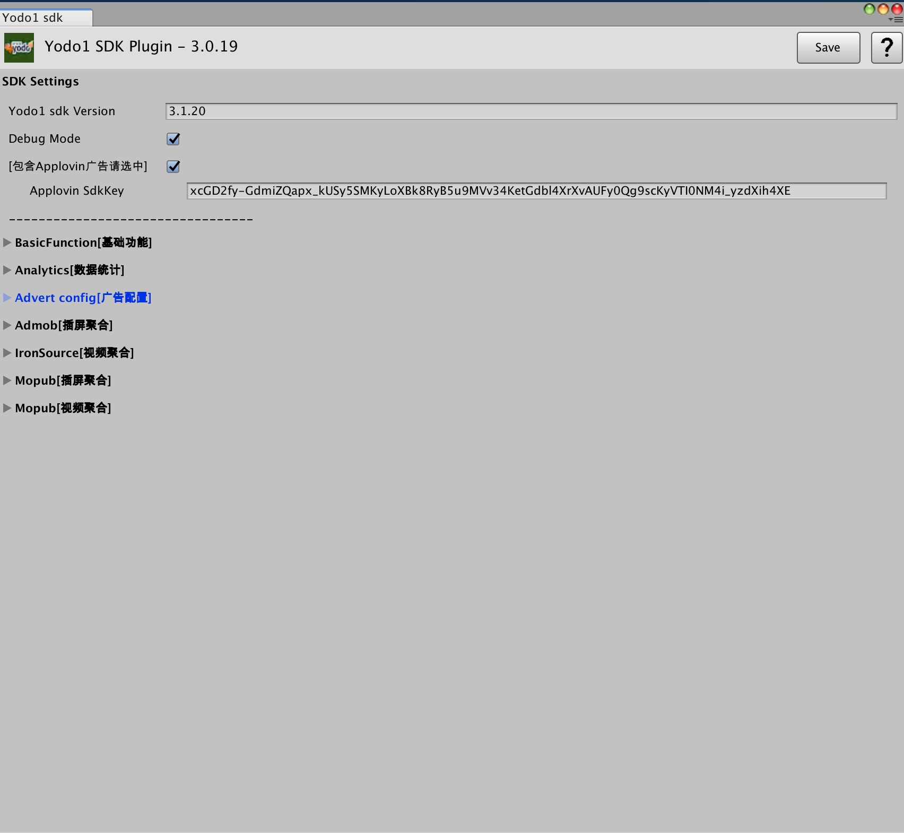
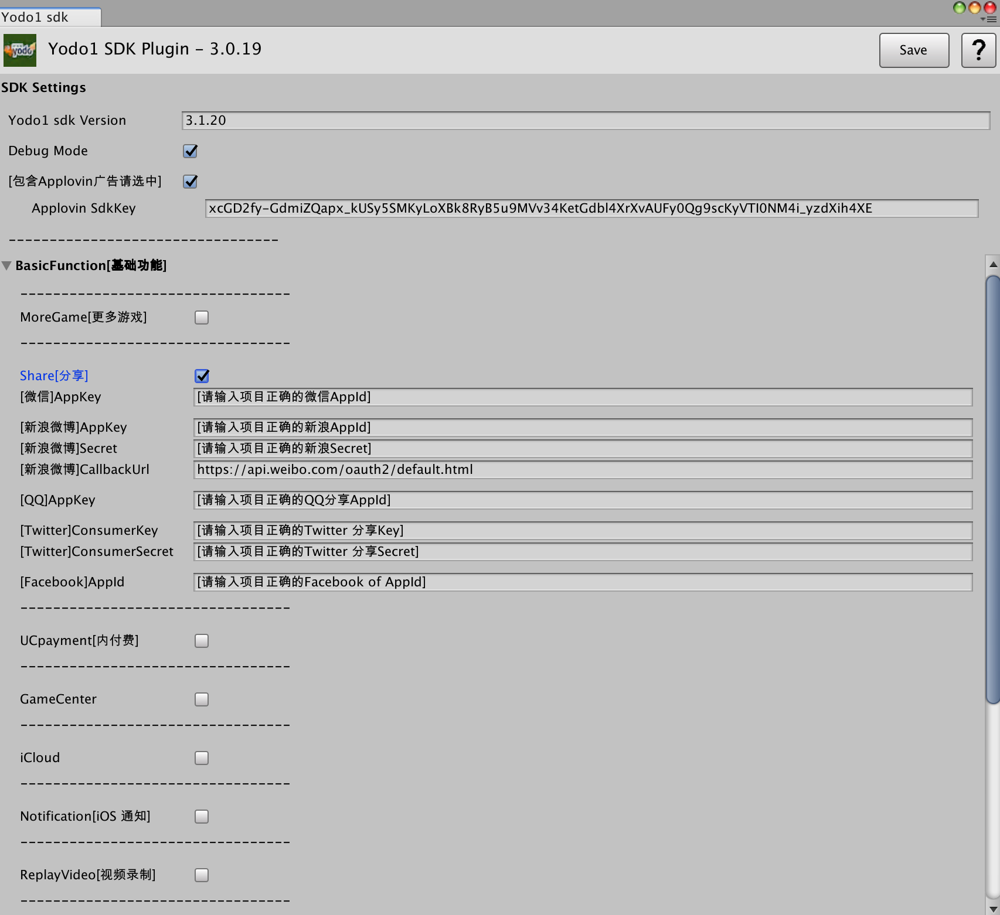
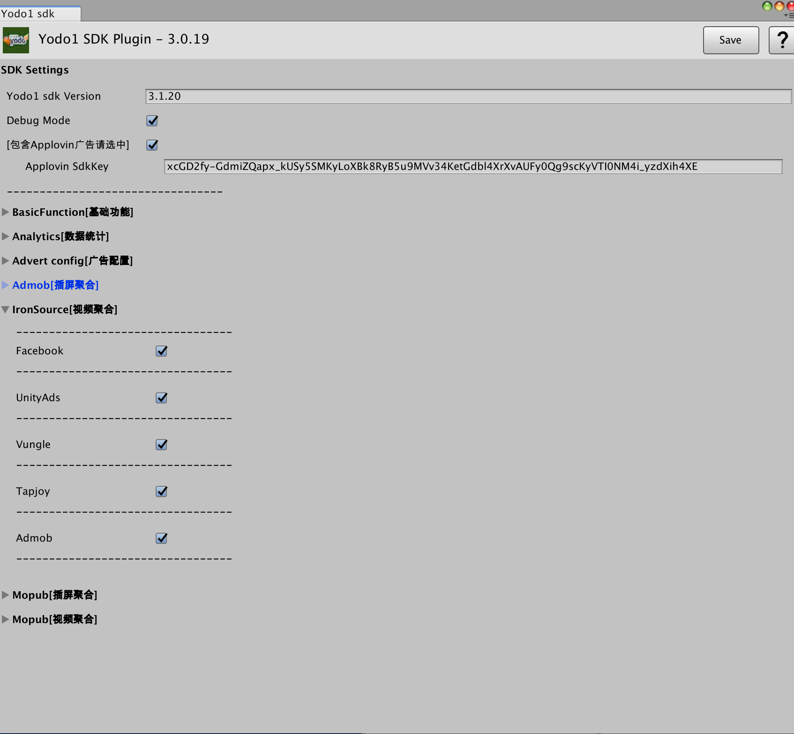

# iOS Integrating

## Yodo1 SDK configuration UI settings introduction

- The upper left corner is the version of Unity release plugin such as `3.0.19`. The `Save` button in the upper right corner is to save the modified related configuration; `?` question mark button is directly connected to this usage instruction page now.

- `SDK Settings` is to use Yodo1 SDK function related settings. `Yodo1 sdk Version` is the version number of Yodo1 sdk released by Cocospods, such as: `3.1.20`.

- `Debug Mode` This is checked when the project needs to print detailed logs. If the project is released Release version will not need to be checked.

- `Include Applovin ads please check ` This setting is required to fill in the correct Applovin SdkKey (note that the Yodo1 ads have two different Keys for global and domestic accounts) Ads need to bring Applovin check on, including mediation.

- Settings UI interface mainly includes `basic functions`, `analytics`, `advertising configuration`, `Amob interstitial mediation`, `IronSource video mediation`, `Mopub insertion mediation`, `Mopub video mediation`

- `Basic Function` as the image below: Select the necessary functions to turn on.
  - For example, share function according to the project needs to fill in the correct relevant AppKey

- Analytics: including Yodo1Tracking tracking analytics, AppsFlyer, GameAnalytics, TalkingData, Umeng `友盟`, Swrve analytics, and
  - Soomla analytics **Note:this according to request, analytics of that platform advertising, check on the corresponding advertising platform, such as Admob**

- In addition to the Yodo1 basic ads, check the syndication ads `Amob inset mediation`, `IronSource video mediation`, `Mopub inset mediation`, `Mopub video mediation` as needed

[Back to Main Page](./README.md)