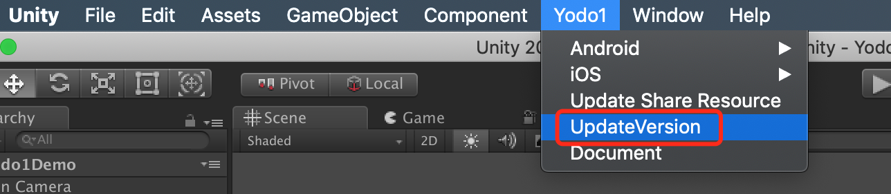

# Yodo1 SDK Unity Plugin Integration

## I. System Introduction

Yodo1 SDK Unity plugin supports **in-game account login, payment, advertising, real name authentication** and other functions.

It supports both PA system packaging and manual packaging.

## II. Install Yodo1 plugin

### New install

Download the latest plugins from the download list below. 

And import the plugin into your Unity project.

**Download List:**

- [Yodo1SDK 4.7.0](https://bj-ali-opp-sdk-update.oss-cn-beijing.aliyuncs.com/Yodo1SdkUnityPlugins/4.7.0/Yodo1SDK.unitypackage)

### Update existed

You can update plugin from Unity menu `Yodo1/UpdateVersion` to get the latest version.

## III. Instructions

You can find the documentation for the relevant platform in the following links

- [Instructions for Android](./DocForAndroid.md)

- [Instructions for iOS](./DocForIOS.md)

- [How to turn on the logs](./DocForLogs.md)

